# MarKo

By Cameron Pocisk and Aditya Pawar

[Play MarKo](https://marko-eosin.vercel.app/)

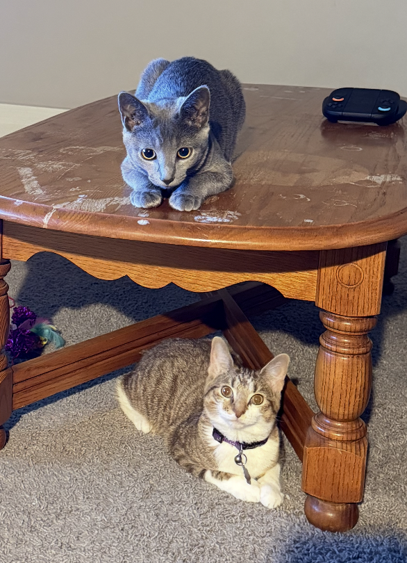

---

# Introduction

In this assignment- we iterated over three levels of implementing our game with different ways to draw the lines and then rendering them. 

The inspiration for our game from our cats- Margo & Koko. Our initial concept was having them shoot/catch treats but we ended up with a more Subway Surfer-esque implementation where we play as the cat and avoid/swat obstacles!

More about this in the Design Aspect. 

## Youtube Video

[Watch on YouTube](https://www.youtube.com/watch?v=-yg39smMpo8)

## Game Description 

In the game- you get to play as a cat and your objective is to avoid/swat at obstacles and reach the finish line where you will be rewarded with Churros!

As the level progresses, your character will speed up and the frequency of obstacles will increase as well to ensure a positive game progression in terms of difficulty. 

## Teamwork Strategies

Cameron started this project by making the cat for level 1
(Projection and implementing the new display and list of V and E's)
Then Cameron started to work on the 3D triangles.
Adi started on the pipeline side- building the pinhole camera and cube for Level 0, then carrying that into Level 1 with the track segments, obstacles, camera movement, the swat action, and the reset logic. From there, Adi moved into Level 2, writing the custom line function and the pixel array display/clearing methods, then handled the obstacle spawning, game logic, and depth projection work once Level 3 came together with Cameron's triangle and 3D shape classes.

In the end we synced up and combined the game logic and 3D objects and triangle things to make a fun game!

---

# Design (Adi and Cameron)

Our first iteration was having Koko and Margo shooting hearts at obstacles to break them and then they can reach the finish. 

We started off with the concept of drawing our cat's head using the vertices and edges as shown below.

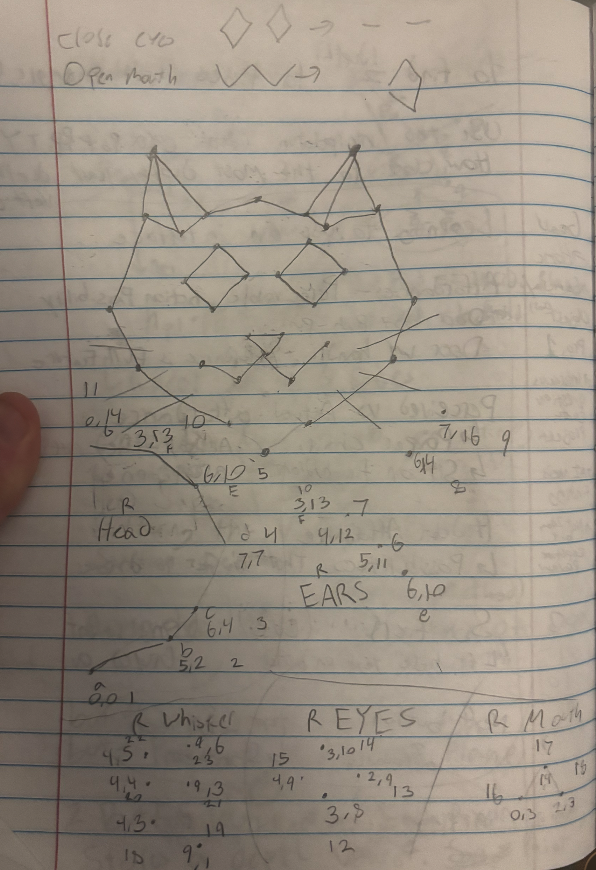

Once we had that implemented- we started to work on the concept of the game. The environment for our game was going to be a track that keeps repeating N number of times as specified for the length of the level. We wanted the cat to have space to move around lanes which also allows for the characters to be scaled up which helped with the clarity of the objects we made. 

Attached below is the image of the initial Track Segment

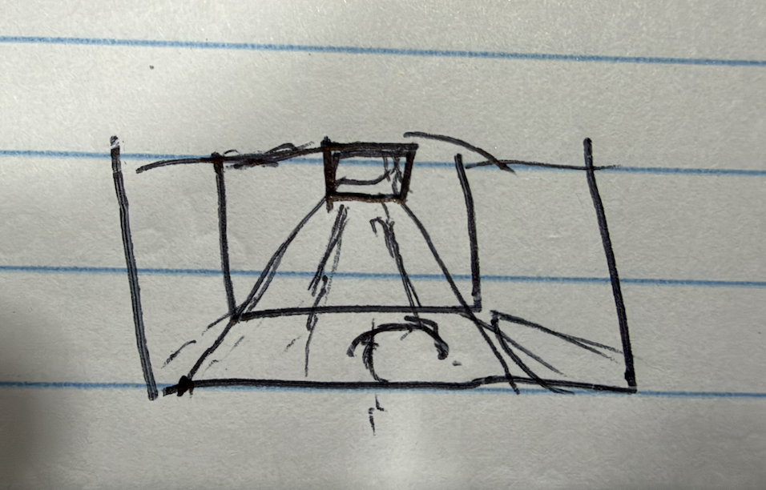

Once we had the track segment finalized- we were able to represent it as a Cube but some missing edges to give the effect of being in an alley along with a long z width to make it a long track segment. 

After the scenery was set- we could move onto making the obstacles to render in the space along with the game logic. 

This is what the base variant of the Trench looked like when rendered in Level 2. We started off with Level 2 and then worked back to Level 1 and then moved on to Level 3.

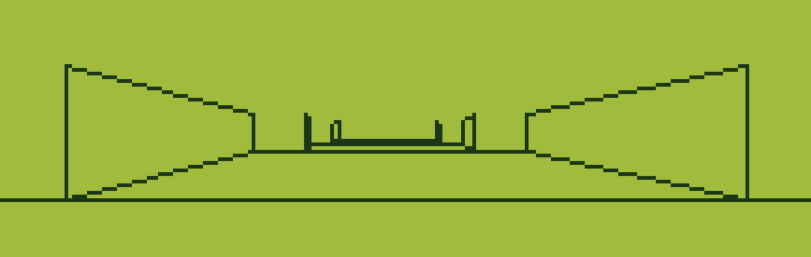

---

# Levels of Implementation

---

## Level 0

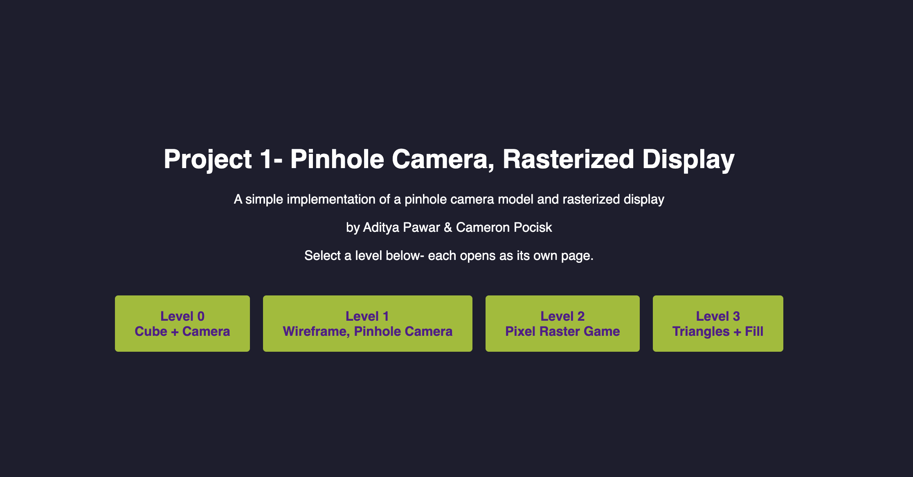

### Rendering a Wireframe Cube and the Basic Pipeline 

Level 0 just needed a 3D cube made of vertices and edges on a canvas, with a camera you can move forward/back and left/right using the arrow keys, no rotation. We got that fully working- the only piece we're short on is the on-page header/instructions, which currently only lives on the main menu (index.html) instead of on level0.html itself.

Before touching any of the actual game objects, Level 0 was really just about getting the whole pinhole camera pipeline working end to end on the simplest shape possible- a cube, defined as 8 vertices and 12 edges centered at the origin.

For the Menu- we made a simple HTML file that lists our different Levels and the buttons to get directed to the levels. Level 0 and Level 1 are simple redirects that ports you in the WireFrame Cube view and the Game drawn out by the JavaScript ctx function. Level 2 and Level 3 directs you to an individual page that has a menu on it and controls listed as well.

The camera starts out sitting back on the z-axis at {x: 0, y: 0, z: -10}, so it's looking at the cube from a distance instead of starting inside it.

To actually get the cube from 3D space onto the 2D canvas, every vertex gets pushed through the same pipeline. 

First we find the vertex's position relative to the camera instead of the world origin- camVert = vertex - camera- since this is really what makes the camera "move". Then we divide by z to get the actual pinhole projection- u = camVert.x / camVert.z and v = camVert.y / camVert.z- which is where the perspective comes from, since the farther something is, the bigger z is, so u and v shrink down, and that's exactly why far away stuff looks smaller. 

Those numbers come out small and centered around 0, so we scale them up by the canvas size and shift by half the canvas so (0,0) lands in the middle of the screen instead of the top left corner. Last thing- canvas y grows downward but our 3D y grows upward, so right before we draw we flip it to canvas.height - v, otherwise the cube renders upside down.

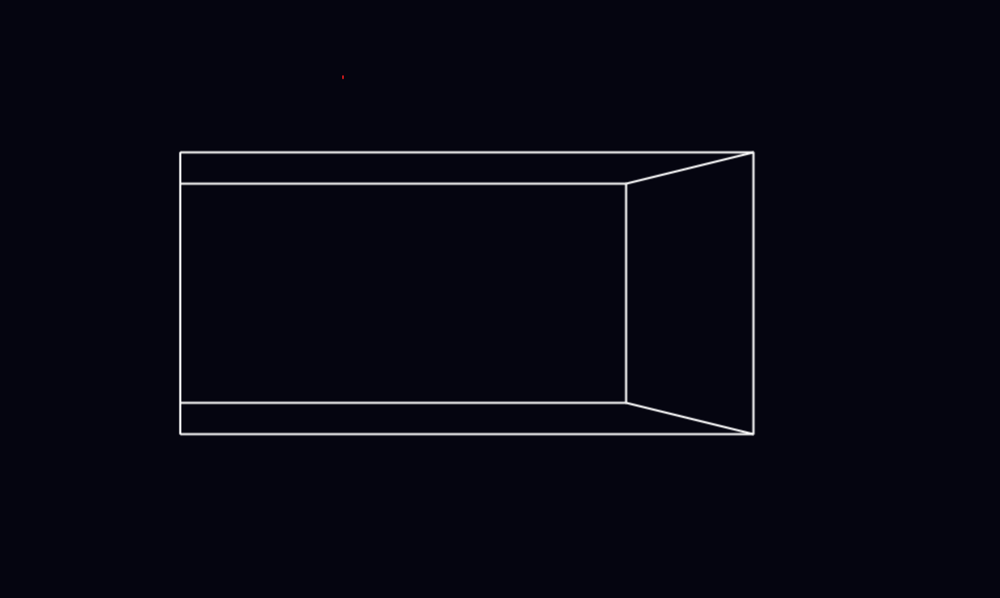

### Controls

- Arrow Up - move the camera forward (increase z)
- Arrow Down - move the camera backward (decrease z)
- Arrow Left - move the camera left (decrease x)
- Arrow Right - move the camera right (increase x)
- R - reset the camera back to its starting position

---

## Level 1

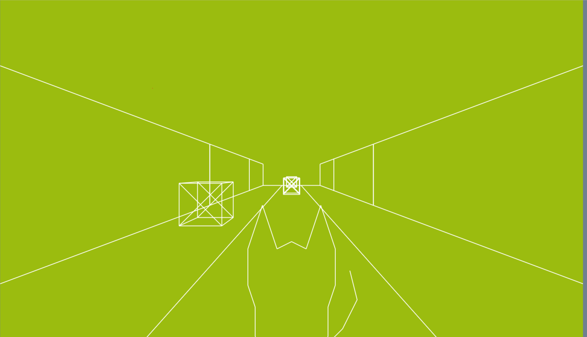

Level 1 asked for a real wireframe scene- at least 3 object types built from vertices and edges, multiple instances with their own position and scale, a pinhole camera you can move with keypresses, some kind of user action, and a keypress to reset everything. We hit most of it- 4 object types, all instanced with translate/scale only, and drawn through the same pinhole projection from Level 0. 

### Making a Wireframe Cat

Making the wireframe for the cat face was not very easy for me. 
In the end I follow this process
1. Draw a cartoony cat face on graph paper. 
2. Try to find good vertices that represent the shape of the cat && number them
3. Label all of the edges
4. Hard code them into the cat class
5. Use the same method in level 0 for drawing the cube 

#### Setting Up Vertices and Edges

### Drawing the Scene

For actually getting things on screen in Level 1, we used the built in functions to draw. drawWireframe takes in the projected vertices and edges for an object, and for each edge just does ctx.beginPath(), moveTo() to the first point, lineTo() to the second, and stroke() to paint it. Everything draws in solid white since we never pass a color in, and clearing the screen each frame is just one ctx.fillRect() covering the whole canvas in the background color before the next frame draws.

#### Multiple Instances

Once we had the track segment and obstacle models set up as vertices and edges, we needed a way to actually place a bunch of copies of them into the world without redefining the shape every time. So each instance just stores its own position vector (x, y, z) and a scale value, and we loop through and spawn a bunch of TrackSegment and Obstacle objects (const-mageddon) at different z positions (random lanes for the obstacles) to build the track out ahead of the camera.

The Obstacle class itself is really just a basic cube- 8 vertices from -1 to 1 in x/y and -0.5 to 0.5 in z, with the normal 12 cube edges plus a couple X-brace diagonals on the front and back faces so it still reads as a box in wireframe instead of looking like a flat square from certain angles. It also carries its own destroyed flag, which is what the swat/collision logic flips to true instead of us needing a separate list to track which ones are gone.

CatBody is a lot more involved- since the camera's always behind the cat, it's built as a back view outline instead of a full head, so there's no eyes/whiskers/mouth like the head model has, just the silhouette- ears, shoulders, sides, tail, and legs, all traced out with edges connecting around 23 vertices.

#### Scaling and Translating Edge Vertex Sets

The base vertices for each object stay defined around the origin- we make sure to never touch them directly. When we go to project an instance, we take each base vertex, multiply it by that instance's scale, then add on the instance's position before subtracting the camera. That's really the only transform happening here- scale then translate, no rotation, which was all we needed since the track is just going straight.

(Cam's note: for the first cat head wireframe, I applied translations at the start of the construction phase.)

#### Camera Movement

In terms of the actual gameplay- the camera keeps moving forward on its own instead of a keypress. The z value increases every frame so it feels like the game is running constantly. In order to go Left and Right- you can use the Arrow Keys to switch the lane we're in which in turn increments/decrements the camera's x position slowly for a smooth transition.

A neat tid-bit we added is a small bob to the cat while it's running- bobPhase increases every frame, and we take the sin of that and multiply it by a small amplitude (BOB_AMPLITUDE) to nudge the cat's y position up and down. The camera itself does not move but it's the cat model translating which makes it more immersive. 

#### User Action

The user action that we allow is for swatting at an obstacle when you're within a range set by a constant. The key to swat is clicking the space-bar which will destroy the object by triggering the .destroyed condition as true for the object Obstacle. 

#### Reset Game

If you do run into an object instead of swatting at it or avoiding it by changing lanes, checkCollisions() catches it and in turn calls resetGame() which puts the camera back at (0,0,0) and in the middle lane. Undestroys the object that you may have destroyed for the level to be played again. 

### Controls

- Arrow Left / Arrow Right - switch lanes
- Space - swat the obstacle in front of you
- P - pause
- Escape - back to menu
- = : Zoom In
- - : Zoom Out

---

## Level 2

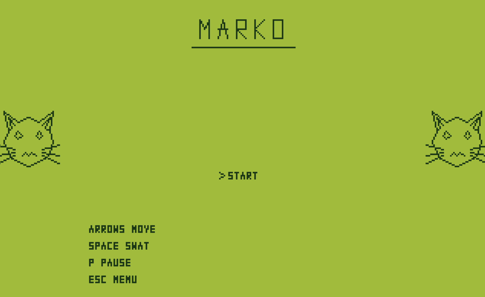

Level 2 asked us to build our own 320x200 pixel grid, write our own line drawing function instead of using the canvas's built in one, and let the user toggle to this version through a different page. We got all of that working- the array, makePixelatedLine, and the page toggle through index.html.

### Using Custom Lines

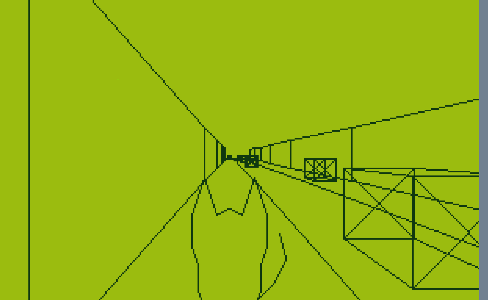

#### Cameron Custom Line (primitive)

I was the first to change the line function and I did a very simple step over for the lines. This worked good when the slope was <= 1
This line drawing fn just calculated the slope, and then applied the slope over all of the points on the line

#### Final Custom Line

For the production version- we moved away from Level 1's Built-in line functions and wrote our own makePixelatedLine that fills in colorPixel calls one at a time. The way it works is by checking whether the line is more horizontal or vertical.

If dx is bigger we walk over x and compute y off the slope for each step, and if dy is bigger we do the same the other way. This is done to make sure that the line comes out solid instead of gapped out. 

Instead of every object calling makePixelatedLine directly for each of its edges- we outsourced that to one drawWireframe function which takes in the projected vertices & edges array and uses that to loop through the edges and calls makePixelatedLine for each one. So, it's just abstraction which looks like drawWireframe(projectInstance(this),this.edges).

### Display Methods

We set up a 320x200 2D Array (displayMatrix) that stores a color string for every pixel. colorPixel then just writes the given color into that array at (x,y)- flipping y since our coordinate system has its origin in the top left  but we want y=0 at the bottom of our screen. The render function loops through the whole array and draws each entry as its own 5x5 rectangle with ctx.fillRect which is what turns our array into blocky low-res look on the screen. 

#### The Dom Grid

On most of the forks for my development, I was working on a version of the game which was colored by way of thousands of individual HTML divs in a grid (absolutely no canvas)
To do this I set up a grid in the HTML, also setup a 320x200 array which would hold the HTML element (and later depth).
When coloring the divs, I added them to a set which would all get colored when the game was ready to draw, then the same set got set to the background color at the start of the next frame. 

### Clearing

Before every frame gets redrawn, clearDisplay() goes through every row in displayMatrix and fills it back with the background color so nothing from the last frame sticks around. Since it's just a color string and not an object, the fill function is reused.

---

## Level 3

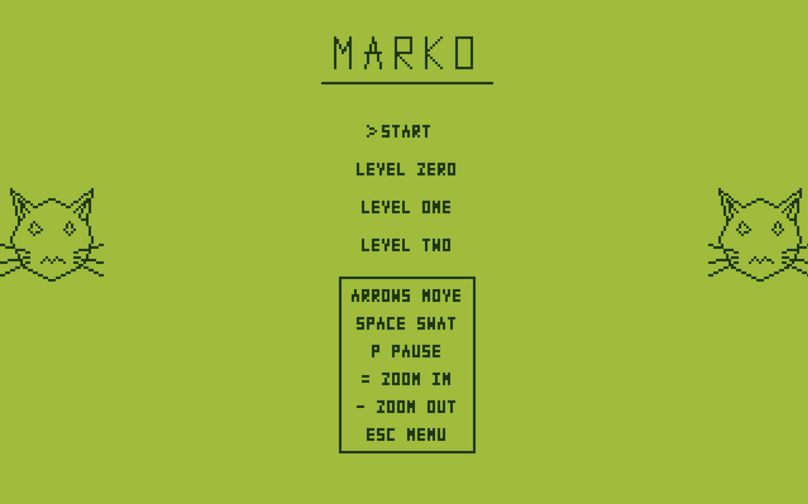

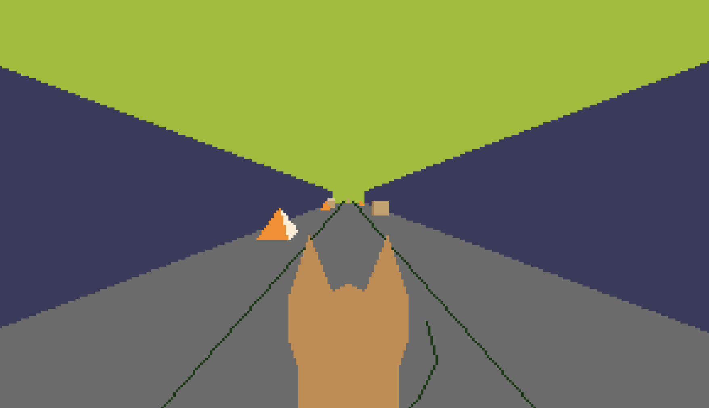

### Obstacles

In Level 1, obstacles were just plain wireframe cubes- 8 vertices with a couple X-brace diagonals so they'd read as boxes instead of flat squares. For Level 3, we swapped that out for two actual shapes built out of triangles instead of edges- a TrafficCone and a CardboardBox, alternating every other obstacle so half the track has cones and half has boxes. Both still get placed the same way as they did back in Level 1 though- same lane array, same random z spacing, and the same destroyed flag driving the swat/collision logic.

### 3D Game Logic

This core logic has actually been here since Level 1- we're just elaborating on it now that Level 3 has real depth and triangles to deal with. All the actual gameplay logic runs off the z-distance between the camera and each obstacle- distance = obstacle.z - camera.z. Collisions check if that distance drops inside COLLISION_RANGE while you're still in the same lane, which triggers resetGame(). Swatting works the same way but off a much bigger SWAT_RANGE, so you get some room to react before actually running into something. Every frame, camera.z increases by FORWARD_SPEED to keep the run going, and camera.x eases toward whichever lane you're in instead of snapping, same as Level 1. Before anything even gets drawn, we also skip track segments and obstacles that are either too far ahead (past MAX_RENDER_DISTANCE) or have already fully passed the camera, so we're not wasting time running triangles through the depth buffer for stuff that can't even be seen.

### Triangle Class

On a separate branch (CameronDivsFork) I implemented a triangle.
The triangle class has these capabilities that I wrote myself
Calculate Triangle area
Get Barycentric Coordinates
Calculate Depth
Scale, Vector Scale, Translate, Rotate X, Y (Did matrix calculations on paper)
I had AI help generate 2 things: 1: Make Clockwise 2: Apply a depth multiplier 

### Traffic Cone Class

Once I made the triangle, I was able to start to make some 3D shapes.
I decided to start with the easiest sounding shape, a pyramid and to make it fun I decided to later color it orange and have adi use it as an obstacle in the game logic.
Once I did make the shape, I was struggling to use the transformations so I had to start it as a 'unit pyramid' which then allowed me to make sensible rotations and scales and then later translations. 

### 3D Shapes and Triangles

Once I implemented the Triangle class and got used to making shapes like the pyramid, I made a general shape class. Which used the fundamental pipeline that we have learned in our class about drawing triangles. This did not end up making it in the final game but I was pretty proud of this. On my own branch I did use it to make a cube!

### Cardboard Box Class

Followed the same pattern as TrafficCone- same constructor, same x/y/z/destroyed fields so the game logic didn't need to change. It's just a cube built out of 12 triangles (2 per face) using Cameron's Triangle class, with each face given its own brown shade so it reads as a proper cube instead of a flat outline.

### Occlusion

To handle occlusion, I only drew the triangles if the new depth was closer than the old depth 
(New depth via barycentric coords and old depth stored in array)

### Barycentric Coordinates

Once I had the triangle area formula, this was relatively straightforward to calculate. I returned the coordinates and they allowed me to determine if any point/pixel was outside the triangle by - area and later the depth by scaling the z coordinates. 

### Translation, Scaling, Rotations

These were pretty fun to do, these were mostly doing vector maths. I even went online to see the rotation matrices and then applied them to my X, Y coordinates. 
I did learn that scaling and rotations after translations were really bad. So near the end I tried implementing a way to queue up all the transformation and apply them at once before drawing in the correct order -- but ran out of time.

#### Clockwise Problem

This was one of my only uses of genAI. I did this because I was getting paranoid and not being able to trust my area code (fundamental) made it difficult to debug. This worked out pretty good and helped me focus on the graphics part of the code a lot more. 

### Depth Projection (and Its Relation to Pinhole Camera)

The depth value we sort by is just camera-relative z- the exact same z from Level 0's pinhole divide (u = x/z, v = y/z). We interpolate that across a triangle with barycentric coordinates, and colorPixelDepth only draws a pixel if that depth is closer than whatever's already there, so overlapping triangles sort themselves out without drawing back-to-front.

---

# Final Thoughts

## Future Work and Reflection

### Cam

There is a lot more to this project than the Vertex and Edges as well as the 3D shapes. Although I tried to implement what I thought was a good portion before the submission, on the final day even though I did a good job and spent a large portion of the whole day on the triangles and shapes there was still more to do. 

### Adi

I would have loved to take this further into a full fledged game, kind of like how the Google Dino game works- just a simple, addictive endless runner you can actually play and lose yourself in. Working through all of this really helped me understand how the core basics of computer graphics work, from the pinhole camera all the way up to triangle rasterization and depth.

## Credits

Here's who worked on what, now that the individual tags are off the section headers above:

**Cam**
- Making a Wireframe Cat / Setting Up Vertices and Edges
- Cameron Custom Line (primitive)
- The Dom Grid
- Triangle Class
- Traffic Cone Class
- 3D Shapes and Triangles
- Occlusion
- Barycentric Coordinates
- Translation, Scaling, Rotations
- Clockwise Problem

**Adi**
- Drawing the Scene
- Multiple Instances
- Scaling and Translating Edge Vertex Sets
- Camera Movement
- User Action
- Reset Game
- Final Custom Line
- Display Methods
- Clearing
- Obstacles
- 3D Game Logic
- Cardboard Box Class
- Depth Projection (and Its Relation to Pinhole Camera)

## AI Usage

### Cam

I used genAI to... 
- make the clockwise member function for triangle
- Help me generate a solution to represent depth better
- Debug in a couple very small spots 

### Adi

I used genAI to...
- Help develop the game flow logic and how the different pieces tie together
- Untangle math I got stuck on, especially tweaking signs and figuring out the right constants for the different methods of drawing lines and displaying them. 
- Build out the menu options for Level 2 & 3 (layout, centering, navigation between levels)
- Speed up my development- it was genuinely effective, but it was a little scary seeing how capable the Claude Code harness actually is. With Great Power comes Great Responsibility. 
- I used it more like a tutor than a one-prompt machine, having it walk me through the concepts instead of just spitting out finished code. 
- The final product is a culmination of Cameron and my vision and not what AI suggested/wanted to do. 
